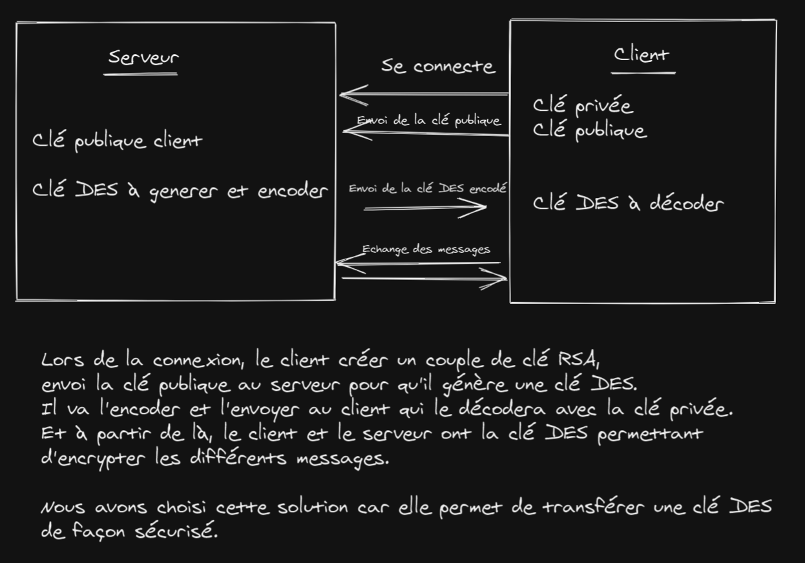

# TD Final
Suzanne ROBERT et Nathan ROUCHÉ
___

[Lien github](https://github.com/Rtinox/Td7-Sys)

## Schéma

## Utilisation 
### Serveur
Lancez la commande `javac Serveur.java && java Serveur`
Puis connectez les clients
Il est possible d'envoyer un message depuis le serveur à tous les clients

### Client
Lancez la commande `javac Client.java && java Client` puis entrez le 'pseudo' du client.
Une fois cela fait, vous pourrez échangez des messages à tous les clients.
Les clients recoivent les messages depuis le serveur de tous les clients.
Chaque client sécurise ses échanges avec un clé RSA differente des autres clients